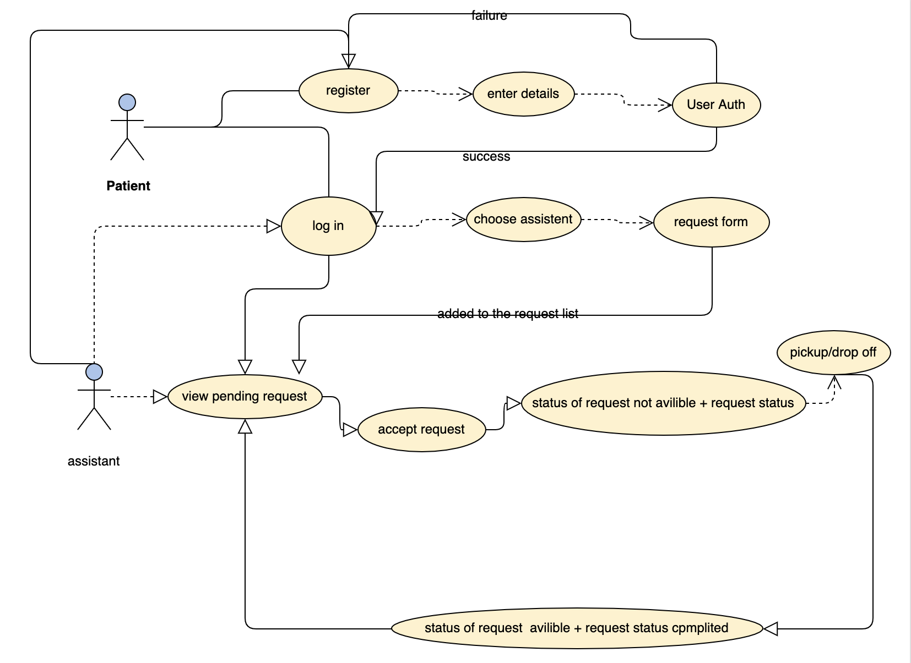

# Meddico Trip backend server

This project serves as the be the backend server for Meddico Trip application. 

with a number of API calls that serves various purposes.

server is implemented in heroku .

## running the server locally:
- fork and clone repo
- npm install 
- run server.js

## technologies used 
- express.js
- mongoDB
- passport
- monggoose

## diagrams

### ERD

### Use Case

## list of API calls

## Links 
Live deployment link: https://hamjahb.github.io/project-4-frontend/#/

GitHub back end: https://github.com/hamjahb/project4

Github React app:https://github.com/hamjahb/project-4-frontend
 

## project team

### Hisham Aljahbli
[linkedin](https://www.linkedin.com/in/haljahbli-softwareeng/).

[github](https://github.com/hamjahb/).

### Obaid Alqahtani 
[linkedin](https://www.linkedin.com/in/obaid-fpga/).

[github](https://github.com/obal3588).

### Sarah Alghofaili
[linkedin](https://www.linkedin.com/in/sarah-alghofaili-web-designer/).

[github](https://github.com/saera1988).
